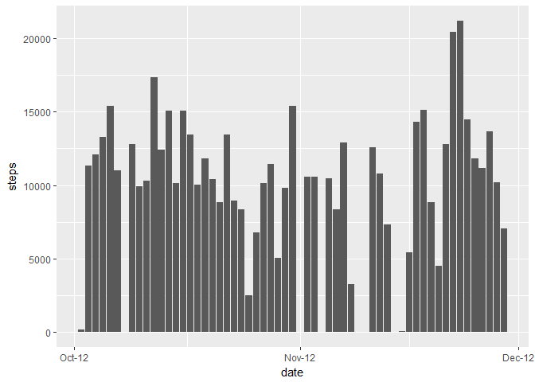
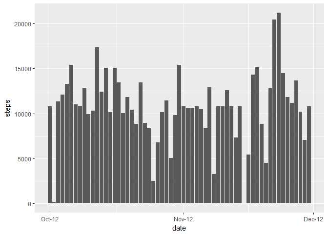

This assignment makes use of data from a personal activity monitoring device. This device collects data at 5 minute intervals through out the day. The data consists of two months of data from an anonymous individual collected during the months of October and November, 2012 and include the number of steps taken in 5 minute intervals each day.

## Loading and preprocessing the data
First we'll download the data from the course website if it doesn't exist locally and then unzip the contents and load the activity file in a data set to be used later.


```r
zipname <- "activity-monitoring.zip"
filename <- "activity.csv"
## Download and unzip the dataset:
if (!file.exists(zipname)){
      fileURL <- "https://d396qusza40orc.cloudfront.net/repdata%2Fdata%2Factivity.zip"
      download.file(fileURL, zipname)
}  
if (!file.exists(filename)) { 
      unzip(zipname) 
}

activity<-read.csv(filename)
```


## What is the mean total number of steps taken per day?

* Make a histogram of the total number of steps taken each day

```r
##load libraries
library(ggplot2)
library(scales)
##aggregate total steps by date
totalsteps<-aggregate(steps~date,data=activity,sum,na.rm=TRUE)
totalsteps$date<-as.Date(totalsteps$date)
##plot
ggplot(data=totalsteps, aes(date, steps)) + geom_histogram(stat="identity")+scale_x_date(breaks = date_breaks("months"), labels = date_format("%b-%y"))
```

```
## Warning: Ignoring unknown parameters: binwidth, bins, pad
```

<!-- -->

* The **mean** total number of steps taken per day is 
    1.076619\times 10^{4} steps.
* The **median** total number of steps taken per day is 
    1.0765\times 10^{4} steps.
    
## What is the average daily activity pattern?
* Here is a time series plot of the 5-minute interval and the average number of steps taken, averaged across all days 

```r
intervalsteps<-aggregate(steps~interval,data=activity,mean,na.rm=TRUE)
plot(steps~interval,data=intervalsteps,type="l")
```

<!-- -->

The **835th** interval contains the maximum number of steps on average across all the days in the dataset.

## Inputing missing values

The total number of missing values in the dataset (i.e. the total number of rows with NAs) is **2304**.

We're going to fill the missing values with the mean of that same interval.

```r
##create a new dataset
missingactivity<-activity
##replace NAs with the mean for that same interval
missingactivity$steps <- ifelse(is.na(missingactivity$steps) == TRUE, intervalsteps$steps[intervalsteps$interval %in% missingactivity$interval], missingactivity$steps)

##aggregate total steps by date
totalfilledsteps<-aggregate(steps~date,data=missingactivity,sum,na.rm=TRUE)
totalfilledsteps$date<-as.Date(totalfilledsteps$date)
##plot
ggplot(data=totalfilledsteps, aes(date, steps)) + geom_histogram(stat="identity")+scale_x_date(breaks = date_breaks("months"), labels = date_format("%b-%y"))
```

```
## Warning: Ignoring unknown parameters: binwidth, bins, pad
```

<!-- -->

The total number of steps without filling in the NA values is **570608**.

The total number of steps filling in the NA values with the mean for that interval is **6.5673751\times 10^{5}**.


## Are there differences in activity patterns between weekdays and weekends?

*Create a new factor variable in the dataset with two levels - "weekday" and "weekend" indicating whether a given date is a weekday or weekend day.


```r
missingactivity$day<-weekdays(as.Date(missingactivity$date))
missingactivity$day=ifelse(missingactivity$day %in% c("Sunday", "Saturday"), "weekend","weekday")
```

* Make a panel plot containing a time series plot of the 5-minute interval (x-axis) and the average number of steps taken, averaged across all weekday days or weekend days (y-axis). 


```r
intervalstepsfactor=aggregate(steps~interval+day,missingactivity,mean)
library(lattice)
xyplot(steps~interval|factor(day),data=intervalstepsfactor,aspect=1/2,type="l")
```

<!-- -->
